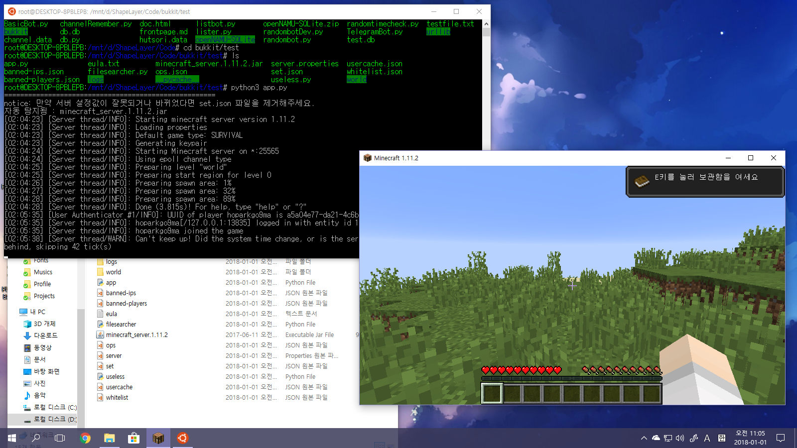

# Minecraft Bukkit with Python3


심심해서 만들어보고있는 마인크래프트 버킷입니다. 일단 기본 기능은 완성되어있습니다. jar파일은 직접 구하셔야합니다. (자동으로 jar파일을 인식합니다.)

## 시작하기

app.py 를 실행하여 버킷을 실행합니다.

 * 이 레포지토리에는 jar파일이 포함되어있지 않습니다. jar파일을 구하셔서 app.py가 위치하는 경로에 넣어주어야 합니다.

### 시작하기에 앞서

이 앱을 실행하기 위해서는 파이썬3 환경이 필수적입니다.

[파이썬 다운로드](https://www.python.org/)

데비안 환경의 경우 아래 명령어로 파이썬3을 편리하게 설치할 수 있습니다.
```
sudo apt-get install python3
```


마인크래프트 서버를 시작하기 위해서는 자바 환경이 필수적입니다.

[자바 다운로드](https://java.com/ko/download/)

데비안 환경의 경우 아래 명령어로 자바를 편리하게 설치할 수 있습니다.
```
sudo apt-get install default-jre
```

## Todo List

 - [ ] ~~자바 버전 감지/선택기능~~

## 주의

 * 두개 이상의 jar파일을 app.py가 위치하는 경로에 동시에 넣지 마세요.

 * 쉘에서 실행 시 경로를 지정해주고 앱을 실행해야합니다.(ex. D:\bukkit 에 버킷이 위치한 경우
 ```
 d:
 cd bukkit
 python app.py
 ```
 )

 ## 라이선스

 이 코드는 AGPL3.0 에 의거하여 보호되고 있습니다. 자세한 사항은 [파일](./LICENSE)을 참고하세요.
